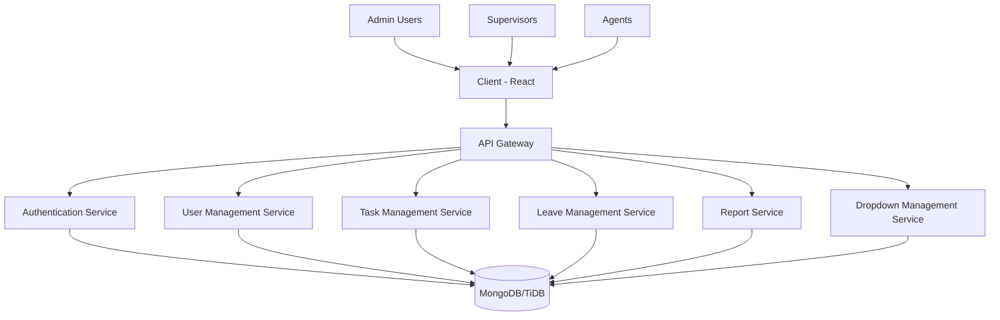
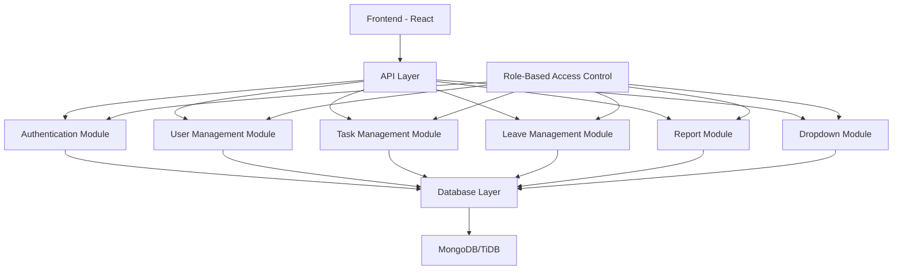
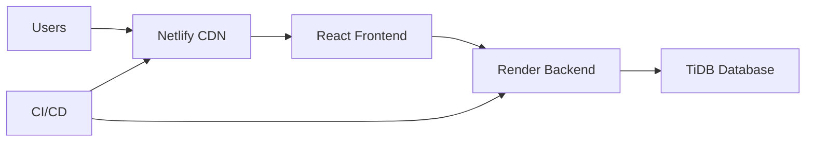

# Quodo3 System Architecture

## Overview

Quodo3 is a full-stack web application built with a modern technology stack to provide a secure and efficient task, leave, and user management system. The architecture follows a client-server model with a React frontend and Node.js/Express backend.

## High-Level Architecture



## Technology Stack

### Frontend
- **React.js**: JavaScript library for building user interfaces
- **React Router**: Declarative routing for React applications
- **Material-UI**: React components that implement Google's Material Design
- **Axios**: Promise based HTTP client for the browser and node.js
- **JWT**: JSON Web Token implementation for token-based authentication

### Backend
- **Node.js**: JavaScript runtime built on Chrome's V8 JavaScript engine
- **Express.js**: Fast, unopinionated, minimalist web framework for Node.js
- **MongoDB/Mongoose**: MongoDB object modeling tool designed to work in an asynchronous environment
- **JWT**: JSON Web Token implementation for token-based authentication
- **bcryptjs**: Library to help hash passwords
- **Joi**: Object schema description language and validator for JavaScript objects

### Database
- **MongoDB**: Document-oriented NoSQL database (compatible with TiDB)
- **Mongoose**: MongoDB object modeling tool

### Deployment
- **Render**: Cloud platform for backend deployment
- **Netlify**: Cloud platform for frontend deployment
- **TiDB**: Distributed SQL database for production use

## Component Diagram



## Data Flow

1. **User Authentication**
   - User submits login credentials
   - Frontend sends credentials to Authentication Service
   - Authentication Service validates credentials against database
   - If valid, JWT token is generated and returned to client
   - Client stores token in localStorage

2. **API Requests**
   - All subsequent requests include JWT token in Authorization header
   - Backend validates token before processing requests
   - Role-based access control determines what actions user can perform

3. **Data Management**
   - CRUD operations for Users, Tasks, Leaves, and Dropdowns
   - All changes are logged in AuditLog collection
   - File uploads are stored in uploads directory with size tracking

4. **Reporting**
   - Aggregated data from Tasks and Leaves collections
   - Filtered by date range, user, status, and other parameters
   - Exportable in multiple formats (CSV, Excel, PDF)

## Security Features

- **Authentication**: JWT-based authentication with secure token storage
- **Authorization**: Role-based access control (RBAC)
- **Data Protection**: Password hashing with bcrypt
- **Input Validation**: Joi validation for all API inputs
- **Secure Headers**: Helmet.js for secure HTTP headers
- **Rate Limiting**: (Future enhancement) To prevent abuse
- **Audit Logging**: All critical actions are logged

## Scalability Considerations

- **Horizontal Scaling**: Backend can be scaled horizontally
- **Database Sharding**: MongoDB/TiDB supports sharding for large datasets
- **Caching**: (Future enhancement) Redis for caching frequently accessed data
- **Load Balancing**: Render provides built-in load balancing
- **Microservices**: Architecture supports breaking into microservices if needed

## Deployment Architecture



## Folder Structure

```
quodo3/
├── client/                 # Frontend React application
│   ├── public/             # Public assets
│   ├── src/                # Source code
│   │   ├── components/     # React components
│   │   ├── contexts/       # React contexts
│   │   ├── services/       # API services
│   │   ├── App.js          # Main App component
│   │   └── index.js        # Entry point
│   ├── .env                # Environment variables
│   └── package.json        # Frontend dependencies
├── middleware/             # Express middleware
├── models/                 # Mongoose models
├── routes/                 # Express routes
├── validators/             # Validation schemas
├── scripts/                # Utility scripts
├── uploads/                # File uploads directory
├── __tests__/              # Test files
├── .env                    # Backend environment variables
├── server.js               # Express server entry point
├── package.json            # Backend dependencies
└── README.md               # Project documentation
```

## API Endpoints

All API endpoints are prefixed with `/api`:

- `/api/auth` - Authentication endpoints
- `/api/users` - User management endpoints
- `/api/tasks` - Task management endpoints
- `/api/leaves` - Leave management endpoints
- `/api/dropdowns` - Dropdown management endpoints
- `/api/reports` - Reporting endpoints

## Database Schema

### User Collection
- Stores user information including credentials, roles, and preferences
- Passwords are hashed using bcrypt
- Role-based access control fields

### Task Collection
- Stores task information including dates, categories, and descriptions
- References to users and offices
- Comments and file attachments support

### Leave Collection
- Stores leave requests with start/end dates and reasons
- Approval workflow with status tracking
- References to approvers

### Dropdown Collection
- Stores configurable dropdown values for forms
- Supports hierarchical relationships (e.g., Category → Service)
- Created/modified by admins

### AuditLog Collection
- Tracks all critical actions in the system
- Includes user, action, timestamp, and details
- Used for security and compliance

## Future Enhancements

1. **Real-time Notifications**: WebSocket integration for real-time updates
2. **Advanced Reporting**: Chart.js or D3.js for data visualization
3. **Mobile Application**: React Native mobile app
4. **Email Integration**: Nodemailer for email notifications
5. **Calendar Integration**: FullCalendar for leave scheduling
6. **Advanced Search**: Elasticsearch for improved search capabilities
7. **Multi-language Support**: i18n for Bangla and English